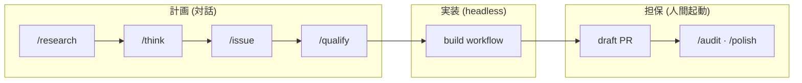

# Commands & Workflows

コマンドと workflow の関係、および build workflow を中心とした開発フロー。

📌 [English version](../../docs/COMMANDS.md)

## 開発フロー全体

計画は人間が対話で練り、実装は build workflow が headless で進め、重い担保は draft PR に対して人間が起動する。

1〜3 ファイルで済む修正は、この列を通らず `/fix <issue 番号>` で直接完結する。4 ファイル以上か新機能は `/think` で plan を書き、`/issue` で issue の `## Plan` 節へ転記してから build に渡す。`/qualify` は任意の事前点検で、build が止まる条件を発行前に検出する。

## build workflow

`Workflow({name: "build", args: {issue, repo, base?}})` で起動する。Plan 節付き issue を入力に、7 つの stage を決定論スクリプトとして実行する。判断の分担は「抽出と実装は LLM、検証と進行はスクリプト」で、LLM の出力は毎回スクリプト側の照合を通る。

| Stage      | 内容                                                                                                    |
| ---------- | ------------------------------------------------------------------------------------------------------- |
| Load       | issue 本文を逐語 fetch し、`## Plan` の U-NNN/T-NNN id を決定論収集。LLM 抽出の結果と id クロスチェック |
| Revalidate | plan の Preconditions (パス + anchor) を現在のコードベースへ再検証                                      |
| Branch     | fresh checkout と分岐点 sha の捕捉。以降の Verify/Ship はこの sha を基準にする                          |
| Code       | `workflow("code")` へ委譲。unit ごとに Red → Green で実装し、plan の指示を trailer に載せて個別コミット |
| Cleanup    | simplify skill による整理と test 検証。テストが落ちたら編集を stash で巻き戻す                          |
| Verify     | 決定論チェック (diff スコープ + T-NNN 照合) と並行して conformance/structure review                     |
| Ship       | 残余 commit + draft PR。PR 本文の fact 節はデータから決定論レンダリングする                             |

正しさの確認は plan 自身のアンカー (Preconditions、files スコープ、T-NNN 言明、conformance) との比較であり、範囲を定めない欠陥探索ではない。欠陥探索は draft PR への `/audit` が担う。

### 停止条件

build は壊れた入力をその場で直さず、stop して差し戻す。代表的な stopped 値 (網羅ではない)。

| stopped             | 意味                                             | 差し戻し先                     |
| ------------------- | ------------------------------------------------ | ------------------------------ |
| no-repo             | args に repo が無い                              | 起動引数を直す                 |
| no-plan             | issue に `## Plan` 節が無い                      | `/think` + `/issue` で plan 化 |
| extraction-mismatch | LLM 抽出の id 集合が本文と食い違う               | plan の書式を直す              |
| oversized-unit      | 非 seam unit が UNIT_CAPS (3 files/4 tests) 超過 | unit を分割する                |
| revalidate-failed   | Preconditions が現在のコードに存在しない         | plan の前提を書き直す          |
| code-failed         | code workflow が unit を完了できない             | plan の contract を見直す      |

### staging ガード

Ship は `git add -A` を使わず、2 つの never-stage 集合で PR への混入を防ぐ。

- build 以前から存在する未追跡ファイル (Revalidate で採取した baseline)
- Verify が plan スコープ外と判定した追跡済み変更 (並行セッションの編集など)

### 統治する DR

| DR                                                                                                     | 決定                                                       |
| ------------------------------------------------------------------------------------------------------ | ---------------------------------------------------------- |
| [DR-0084](../../docs/decisions/0084-retire-issue-gate-and-hand-issue-flow-orchestration-to-human.md)   | build は人間の `## Plan` 節を再計画しない                  |
| [DR-0085](../../docs/decisions/0085-replace-builds-audit-fan-out-with-selection-based-verification.md) | 重い担保 (`/audit`、`/polish`) は draft PR に人間が起動    |
| [DR-0088](../../docs/decisions/0088-commit-each-unit-in-build-with-plan-anchors-as-trailers.md)        | unit ごとにコミットし、Verify/Ship は分岐点 sha を基準     |
| [DR-0089](../../docs/decisions/0089-retire-build-plan-drafting-and-hand-plan-less-issues-back.md)      | plan なし issue は no-plan で停止し精緻化に差し戻す        |
| [DR-0090](../../docs/decisions/0090-unify-workspace-and-history-storage-locations.md)                  | 成果物は `.claude/workspace/`、履歴は `~/.claude/history/` |

## Workflow 一覧

build が入れ子で呼ぶのは code のみ。他は単体起動する。

| Workflow | 役割                                                      | 主な nested agent                                   |
| -------- | --------------------------------------------------------- | --------------------------------------------------- |
| build    | Plan 付き issue の end-to-end 実装                        | code (入れ子)、reviewer-conformance、reviewer-reuse |
| code     | 構造化 plan の TDD 実装 (Implement/Verify)                | 実装 agent (既定 sonnet)、独立 verify agent         |
| audit    | diff への adversarial review fan-out                      | file-routed reviewer、critic-audit、critic-evidence |
| polish   | Codex 外部レンズの review + cleanup                       | critic-audit、enhancer-code                         |
| assert   | merge readiness の独立判定 (Codex を隔離 worktree で並走) | codex、critic 層                                    |
| shake    | flaky テストの 4 次元検出と根本修正                       | 実行 agent、静的 smell scan                         |
| adrift   | DR と現行コードの乖離スキャン                             | manifest-routed reviewer                            |

## Command → 実装マッピング

| コマンド  | 実装                    | 形態                                    |
| --------- | ----------------------- | --------------------------------------- |
| `/think`  | `skills/think/SKILL.md` | skill (critic-design を起動)            |
| `/fix`    | `skills/fix/SKILL.md`   | skill (generator-test、resolver-build)  |
| `/build`  | `workflows/build.js`    | workflow                                |
| `/code`   | `workflows/code.js`     | workflow (build から入れ子でも呼ばれる) |
| `/audit`  | `workflows/audit.js`    | workflow                                |
| `/polish` | `workflows/polish.js`   | workflow                                |

skill は SKILL.md の手順を会話の文脈で実行し、workflow はスクリプトが進行を強制する。fan-out、ループ、ゲートを持つ処理は workflow に置き、LLM の裁量で飛ばせない形にする ([WORKFLOWS](../rules/conventions/WORKFLOWS.md))。

## 関連

- [SKILLS_AGENTS.md](./SKILLS_AGENTS.md). Skill とエージェントのリファレンス
- [DESIGN.md](./DESIGN.md). レイヤー構造と設計哲学
