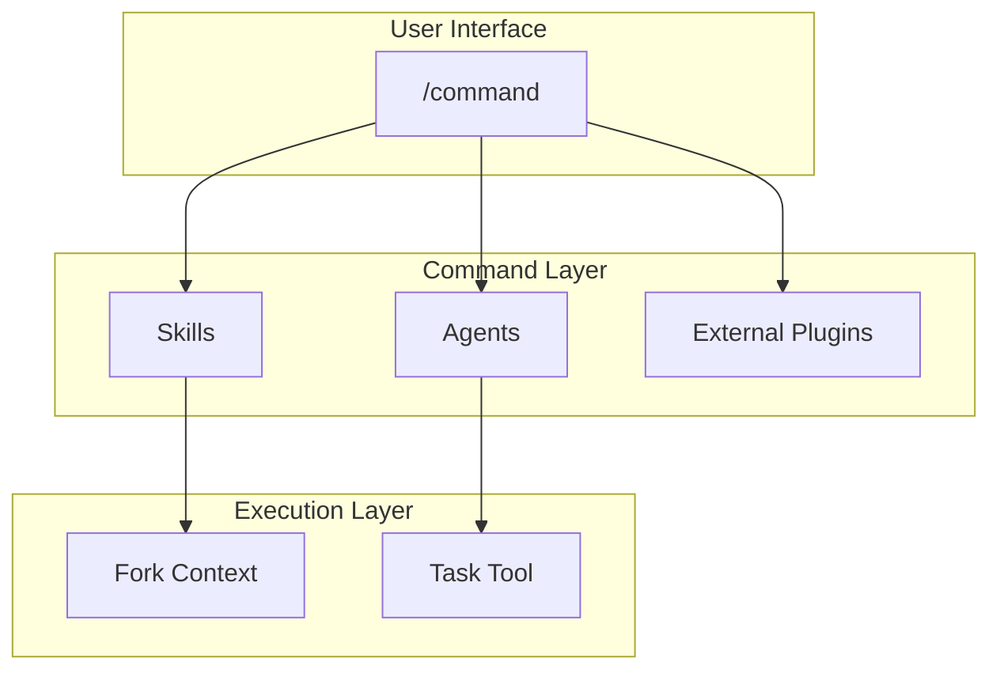

# Commands Design

コマンドの設計と関係。

📌 [English version](../../docs/COMMANDS.md)

## アーキテクチャ



## 設計原則

### 1. Thin Wrapper パターン

コマンドはオーケストレータ。実装詳細は持たない。

```markdown
# Good: /code

- Skills: use-workflow-tdd-cycle (RGRC cycle definition)
- Native: /goal (optional autonomous iteration)

# Bad

- TDD ステップをコマンド内にハードコード
```

### 2. 条件付きコンテキスト ロード

必要なときにのみ skill をロードする。

```markdown
/code (フラグなし) → 追加 skill なし
```

### 3. Graceful Degradation

外部プラグインなしでもコマンドが動く。

```markdown
/goal ラップあり → 自律反復; なし → gates 自動リトライ + 手動確認 (同機能)
```

## Command → Skill/Agent マッピング

| コマンド  | 実装                       | 使用 Agent / nested call                                                                  |
| --------- | -------------------------- | ----------------------------------------------------------------------------------------- |
| `/think`  | `skills/think/SKILL.md`    | critic-design                                                                             |
| `/code`   | `workflows/code.js`        | general-purpose の実装・検証 agent                                                        |
| `/audit`  | `workflows/audit.js`       | file-routed reviewer、critic-audit、critic-evidence、enhancer-integration                 |
| `/fix`    | `skills/fix/SKILL.md`      | generator-test、resolver-build                                                            |
| `/polish` | `workflows/polish.js`      | general-purpose、critic-audit、enhancer-code                                               |
| `/build`  | `workflows/build.js`       | nested workflow は code のみ。audit / polish は人間が個別起動し、fix は連鎖しない        |

## ファイル構造

```text
skills/
├── fix/SKILL.md       # YAML frontmatter + 実行ステップ
├── think/SKILL.md
└── ...
workflows/
├── code.js
├── audit.js
├── polish.js
├── build.js
└── ...
```

### Frontmatter フィールド

| フィールド      | 必須 | 用途                             |
| --------------- | ---- | -------------------------------- |
| `description`   | Yes  | コマンド説明 (Skill picker 表示) |
| `allowed-tools` | No   | 許可ツール                       |
| `model`         | No   | 使用モデル (opus/sonnet/haiku)   |
| `argument-hint` | No   | 引数入力時に表示するヒント       |

## 関連

- [SKILLS_AGENTS.md](./SKILLS_AGENTS.md). Skill とエージェントのリファレンス
