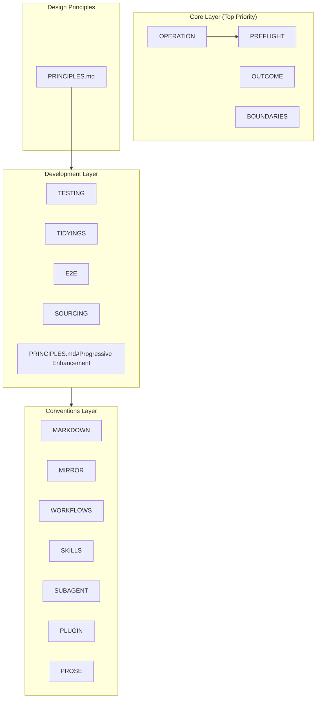
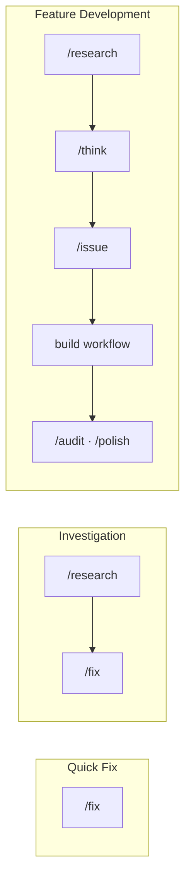

# Design Philosophy

AI コーディング アシスタントの一貫性と品質のためのフレームワーク。

📌 [English version](../../docs/DESIGN.md)

## アーキテクチャ概要



## レイヤー別の設計意図

### 1. Core Layer. 安全性と透明性

最優先のルール。AI の暴走を防ぎ、ユーザーに状況を伝える。

| ファイル                                  | 意図             | 主な仕組み                                    |
| ----------------------------------------- | ---------------- | --------------------------------------------- |
| [OPERATION](../rules/core/OPERATION.md)   | 安全性の確保     | `rm` 禁止 → `mv ~/.Trash/`、破壊的操作の確認  |
| [PREFLIGHT](../rules/core/PREFLIGHT.md)   | タスク確認の統一 | Rationalization counter、分割閾値、完了の定義 |
| [OUTCOME](../rules/core/OUTCOME.md)       | 成果状態の可視化 | Outcome test、更新トリガー                    |
| [BOUNDARIES](../rules/core/BOUNDARIES.md) | 原則の適用境界   | 一般定義からの差分 (閾値、既定の修正)         |

#### 設計理由

- `rm` を禁止し、`mv ~/.Trash/` で macOS のごみ箱から戻せるようにする
- Rationalization counter がモデルによる scope check の自己除外を防ぐ
- 分割閾値 (Files ≥5, Features ≥3) がスコープ膨張を防ぐ

### 2. Design Principles. 意思決定フレームワーク

設計判断のための優先順位と衝突解決。

| ファイル                                | 意図                             |
| --------------------------------------- | -------------------------------- |
| [PRINCIPLES.md](../rules/PRINCIPLES.md) | 原則の優先度、依存関係、衝突解決 |

#### 原則の階層

```text
Foundation (Outcome-driven / Backcasting)
    ↓
Critical (Occam's Razor / Progressive Enhancement / Systems Thinking)
    ↓
Default (Readable Code / TDD / DRY / YAGNI Boundary ほか)
    ↓
Contextual (SOLID / Law of Demeter / TIDYINGS ほか)
```

#### 衝突解決の例

| 衝突               | 勝つ側   | 理由                                 |
| ------------------ | -------- | ------------------------------------ |
| DRY vs Readable    | Readable | 明瞭性を損なう抽象より重複           |
| SOLID vs Simple    | Simple   | 想像上の将来のための過剰設計を避ける |
| Perfect vs Working | Working  | 実問題を解くなら出荷する             |

### 3. Development Layer. 実用基準

日々の開発のための具体的な基準。

| ファイル                                                        | 意図                     | 主な閾値                               |
| --------------------------------------------------------------- | ------------------------ | -------------------------------------- |
| [TESTING](../rules/development/TESTING.md)                      | カバレッジの観点と質     | delta-based gate、優先領域別の深度     |
| [TIDYINGS](../rules/development/TIDYINGS.md)                    | クリーンアップの範囲制限 | 振る舞い変更なし、編集ファイル限定     |
| [E2E](../rules/development/E2E.md)                              | E2E suite の範囲制限     | 主要経路に限った小さな suite           |
| [SOURCING](../rules/development/SOURCING.md)                    | 出典に基づく API 記述    | 固定バージョンの公式ドキュメントを優先 |
| [PRINCIPLES.md#Progressive Enhancement](../rules/PRINCIPLES.md) | 段階的構築               | CSS-First、Outcome-First               |

#### AI 失敗パターン (インライン)

| パターン             | トリガー                  | アクション                   |
| -------------------- | ------------------------- | ---------------------------- |
| Context Bloat        | 使用率 >70%               | `/clear` または `/compact`   |
| Repeated Fixes       | 同じエラーで 3 回目       | 具体性を増して再フレーム     |
| Infinite Exploration | 10 ファイル以上読み未編集 | サブエージェントで縮小       |
| Wrong Direction      | 「望んだものではない」    | チェックポイントへ `/rewind` |

#### 設計理由

- 無限探索や繰り返し修正など AI のパターンを自己検出
- `TIDYINGS` がクリーンアップ範囲を絞り、過剰リファクタを防ぐ

### 4. Conventions Layer. 一貫性ルール

ドキュメント、プラグイン、翻訳の一貫性。

| ファイル                                       | 意図                       |
| ---------------------------------------------- | -------------------------- |
| [MARKDOWN](../rules/conventions/MARKDOWN.md)   | Markdown 規約              |
| [MIRROR](../rules/conventions/MIRROR.md)       | `.ja/` 正のミラー運用      |
| [WORKFLOWS](../rules/conventions/WORKFLOWS.md) | Workflow スクリプトの規約  |
| [SKILLS](../rules/conventions/SKILLS.md)       | Skill 定義の標準           |
| [SUBAGENT](../rules/conventions/SUBAGENT.md)   | サブエージェント定義の標準 |
| [PLUGIN](../rules/conventions/PLUGIN.md)       | プラグイン制約             |
| [PROSE](../rules/conventions/PROSE.md)         | 語彙の具体化と文の接続     |

#### 設計理由

- 参照深度を制限 (Skills 1 階層、Rules 3 階層)。階層が増えるほど読むファイルが増える
- 翻訳内容の差を許容しつつ EN/JP の構造を揃える

### 5. Workflows Layer. ユーザー インターフェース

ユーザー向けコマンドとワークフロー システム。

#### ワークフロー パターン



Feature Development の詳細 (build の 7 つの stage、停止条件、統治 DR) は[COMMANDS](./COMMANDS.md)が持つ。

## 根底の哲学

| 哲学         | 実装                                              |
| ------------ | ------------------------------------------------- |
| Transparency | チェックリスト、出典引用、進捗の可視化            |
| Safety       | 破壊的操作の禁止/確認、ごみ箱への移動、復旧可能性 |
| Consistency  | 命名規約、ファイル構造、コマンド体系              |
| Learnability | 説明モード、Insight 表示                          |

「AI は誤る」を前提にする。

- 誤りを発見しやすくする
- 誤りを修正しやすくする
- 誤りの被害を最小化する

## 詳細ドキュメント

| ドキュメント                        | 内容                                               |
| ----------------------------------- | -------------------------------------------------- |
| [COMMANDS](./COMMANDS.md)           | コマンドと workflow の関係、build 中心の開発フロー |
| [SKILLS_AGENTS](./SKILLS_AGENTS.md) | Skill/agent の仕組みと利用                         |
| [HOOKS](./HOOKS.md)                 | Hook システムと Quality Pipeline                   |
| [GLOSSARY](./GLOSSARY.md)           | ユビキタス言語辞書                                 |

---

_「使い方」については[README.md](../README.md)を参照。_
