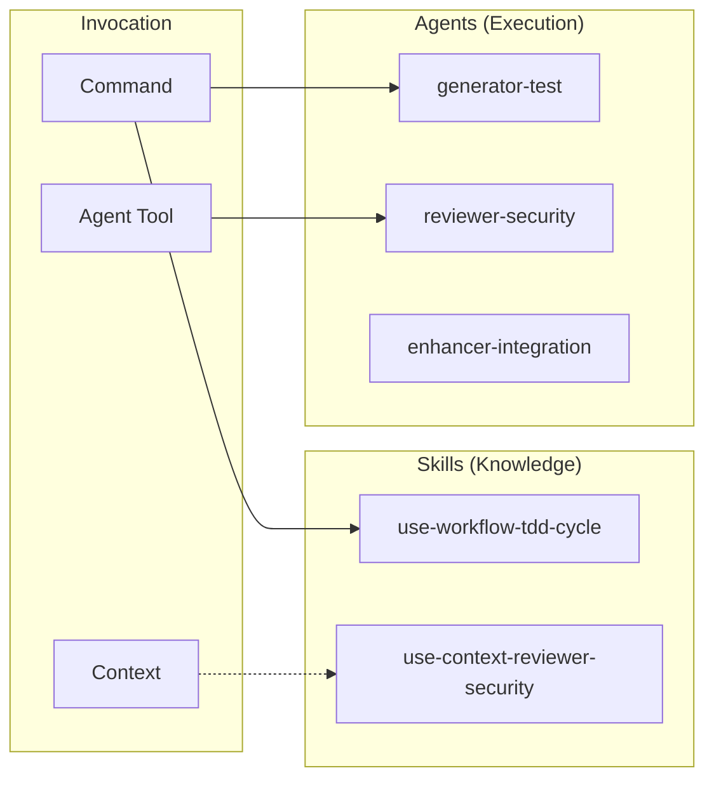
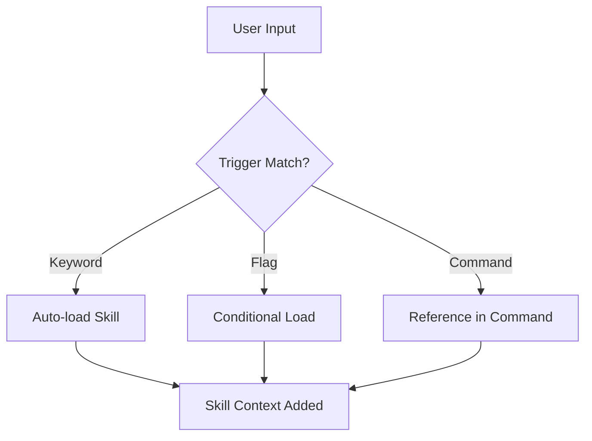

# Skills & Agents Design

Skill とエージェントの設計意図と利用ガイドライン。

📌 [English version](../../docs/SKILLS_AGENTS.md)

## コアコンセプト



## Skills と Agents

`dr` は DR file と index を Write/Edit で生成し、`commit` は `git commit` を実行する。そのため Skill の状態と出力は許可ツールと手順に依存する。

| 観点         | Skills                              | Agents           |
| ------------ | ----------------------------------- | ---------------- |
| 役割         | ナレッジベースまたは手順 (What/How) | 実行者 (Do)      |
| 起動         | 自動ロードまたはコマンド参照        | Agent ツール経由 |
| コンテキスト | メイン または fork                  | 常に fork        |
| 状態         | 読み取りまたは変更                  | 可変             |
| 出力         | 情報、ファイル、または実行結果      | アーティファクト |

## Skills

### 用途

Skills は「ナレッジモジュール」。AI がタスク実行時にドメイン固有の知識を提供する。

### カテゴリ

`/code`、`/audit`、`/polish` は `workflows/*.js` の Workflow であり、Skill ではない。User-invocable Skills は下表の 17 件。

| カテゴリ       | Skills                                                                                                                          | 用途                         |
| -------------- | ------------------------------------------------------------------------------------------------------------------------------- | ---------------------------- |
| Workflow       | use-workflow-tdd-cycle, use-workflow-pageshot                                                                                   | 多段ワークフロー定義         |
| Context        | use-context-reviewer-\*, use-context-root-cause-analysis                                                                        | エージェント向けドメイン知識 |
| CLI ラッパー   | use-cli-codegraph, use-cli-recall, use-cli-scout, use-cli-gcloud                                                                | CLI ツール統合               |
| User-invocable | census, challenge, checkout, commit, dr, fix, issue, outcome, pr, preview, qualify, research, scribe, slice, stock, think, xlsx | スラッシュコマンドの入口     |

### ロード機構



トリガー例:

| トリガー                | ロードされる Skill              |
| ----------------------- | ------------------------------- |
| "TDD", "test-driven"    | use-workflow-tdd-cycle          |
| "OWASP", "セキュリティ" | use-context-reviewer-security   |
| "5 Whys", "root cause"  | use-context-root-cause-analysis |

### ファイル構造

```text
skills/[skill-name]/
├── SKILL.md        # 必須: YAML frontmatter + 知識本体
└── references/     # 任意: 詳細ガイド
    └── *.md
```

### YAML Frontmatter

```yaml
---
name: use-workflow-tdd-cycle
description: TDD with RGRC cycle and Baby Steps.
when_to_use: TDD, テスト駆動, Red-Green-Refactor, Baby Steps
allowed-tools: Read Write Edit Bash(ugrep:*) Bash(bfs:*)
context: fork # fork または inline
background: false
user-invocable: false # スラッシュコマンドとして起動可能か
---
```

## Agents

### 用途

エージェントは「専門実行者」。Agent ツール経由で起動し、特定の分析や生成タスクを自律的に行う。

### カテゴリ

```text
agents/
├── critics/        # 反論検証 (critic-audit, critic-design, critic-evidence)
├── enhancers/      # コード改善・結果統合 (enhancer-code, enhancer-evidence, enhancer-integration)
├── explorers/      # 探索 (explorer-feature)
├── generators/     # 生成 (generator-test, generator-snapshot)
├── resolvers/      # 問題解決 (resolver-build)
└── reviewers/      # レビュー (18 種の専門 reviewer)
```

### Reviewer Agents (18 種)

| Agent                  | 焦点                              |
| ---------------------- | --------------------------------- |
| reviewer-accessibility | WCAG 2.2 適合                     |
| reviewer-causation     | 5 Whys 根本原因分析               |
| reviewer-conformance   | diff と spec の適合性             |
| reviewer-coverage      | テストカバレッジ品質              |
| reviewer-design        | deletion test による module depth |
| reviewer-duplication   | クロスファイル DRY 分析           |
| reviewer-efficiency    | アルゴリズムコスト、ホットパス    |
| reviewer-operations    | エラー境界、ロギング              |
| reviewer-progressive   | CSS-first、JS 削減                |
| reviewer-prompt        | LLM プロンプト定義の品質          |
| reviewer-react-pattern | React 設計パターン                |
| reviewer-readability   | コード構造、可読性                |
| reviewer-resilience    | 耐障害性の弱点分析                |
| reviewer-reuse         | 既存コードの再利用機会            |
| reviewer-rust          | Rust idiom と安全性               |
| reviewer-security      | OWASP Top 10                      |
| reviewer-silence       | サイレント失敗の検出              |
| reviewer-testability   | テスト可能なコード設計            |

### Agent ツールでの起動

```markdown
Agent tool で:

- subagent_type: "reviewer-security"
- prompt: "Review the authentication module for vulnerabilities"
- model: "sonnet" (任意)
```

## 設計判断

### Skill と Agent を分ける理由

| 理由             | 説明                                                 |
| ---------------- | ---------------------------------------------------- |
| 関心の分離       | 知識 (Skills) と実行 (Agents) を分離                 |
| コンテキスト管理 | エージェントは fork で動き、メインの文脈を汚染しない |
| 再利用性         | Skill は複数のコマンドから参照できる                 |
| 専門化           | エージェントは特定タスクに特化し、より深い分析を行う |

### 参照深度ルール

```text
SKILL.md → reference.md (1 階層のみ)
```

理由: 階層が増えるほど読むファイルが増え、参照グラフも追いにくくなる。

## 関連

- [COMMANDS.md](./COMMANDS.md). コマンドと workflow の関係、build 中心の開発フロー
- [SKILLS](../rules/conventions/SKILLS.md). Skill 定義書式
- [SUBAGENT](../rules/conventions/SUBAGENT.md). サブエージェント定義書式
