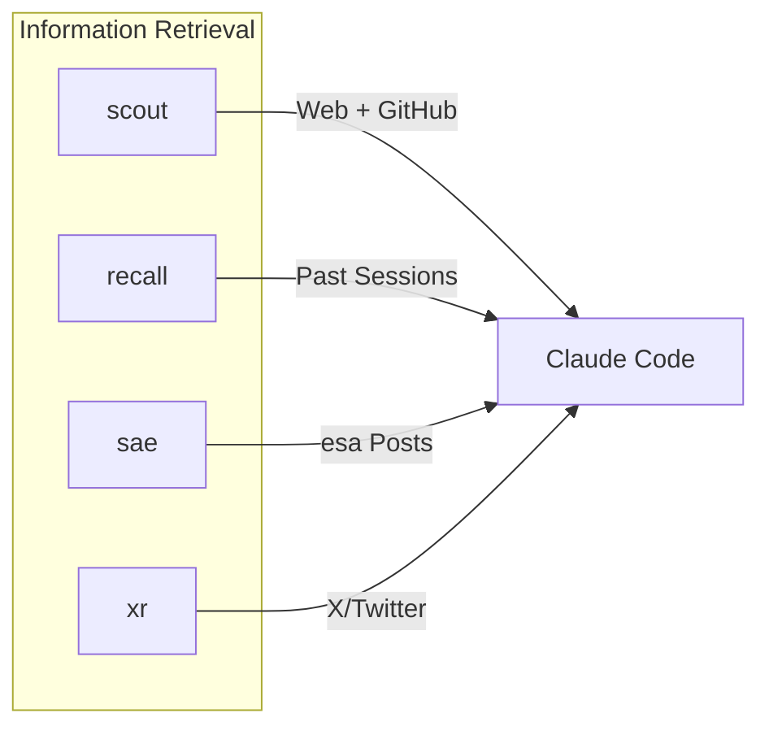

# CLI Tools

External CLI tools that extend Claude Code's capabilities.

📌 **[日本語版](../.ja/docs/CLI_TOOLS.md)**

## Overview

4 Rust CLI tools (scout, recall, sae, and xr), each purpose-built for a specific
gap in Claude Code's default tooling. This document covers design intent and
architecture.

## scout

Web search and page fetching via the Brave Search API.

| Aspect  | Detail                                                           |
| ------- | ---------------------------------------------------------------- |
| Why     | WebFetch/WebSearch consume tokens and lack Markdown conversion   |
| How     | Brave Search API for search, readability for page extraction      |
| Install | `brew install thkt/tap/scout`                                    |
| Source  | [thkt/scout](https://github.com/thkt/scout)                      |

### Commands

| Command               | Purpose                                      |
| --------------------- | -------------------------------------------- |
| `scout search`        | Web search (Brave Search API)                |
| `scout fetch`         | Fetch URL as clean Markdown                  |
| `scout research`      | Deep research (search + fetch + compile)     |
| `scout repo-overview` | GitHub repo overview (stars, issues, README) |
| `scout repo-tree`     | List files in remote GitHub repo             |
| `scout repo-read`     | Read a file from remote GitHub repo          |

### When to Use

| scout                          | WebFetch/WebSearch      |
| ------------------------------ | ----------------------- |
| Latest docs, release notes     | Never (scout preferred) |
| GitHub repo exploration        | Never (scout preferred) |
| Deep research with compilation | N/A                     |

## recall

Full-text search across past Claude Code and Codex sessions (FTS5-based SQLite
index).

| Aspect  | Detail                                              |
| ------- | --------------------------------------------------- |
| Why     | Session history in JSONL is unsearchable by default |
| How     | FTS5 index over session transcripts                 |
| Install | `brew install thkt/tap/recall`                      |
| Source  | [thkt/recall](https://github.com/thkt/recall)       |

### Commands

| Command                                      | Purpose                            |
| -------------------------------------------- | ---------------------------------- |
| `recall search "query"`                      | Full-text search across sessions   |
| `recall search --days N "query"`             | Filter to last N days              |
| `recall search --project <PATH> "query"`     | Filter by project path             |
| `recall search --source <SOURCE> "query"`    | Filter by source (claude or codex) |
| `recall index`                               | Incrementally index new logs       |
| `recall rebuild`                             | Re-parse and re-index all sessions |

### When to Use

| recall                             | Grep \*.jsonl               |
| ---------------------------------- | --------------------------- |
| Past solutions: "how did I fix X"  | Current session only        |
| Pattern recall: "what tool for Y"  | Specific known session file |
| Cross-project: "where did I use Z" |                             |

## sae

Semantic search and read-only retrieval for esa posts. `settings.json` permits
the read-only `search`, `status`, and `get` commands.

### Commands

| Command              | Purpose                            |
| -------------------- | ---------------------------------- |
| `sae search "query"` | Semantic search over indexed posts |
| `sae status`         | Show synchronization/index status  |
| `sae get <NUMBER>`   | Fetch a post by number             |

## xr

X/Twitter content fetching (tweets, threads, articles, user profiles).

| Aspect  | Detail                                                   |
| ------- | -------------------------------------------------------- |
| Why     | scout fetch cannot extract X/Twitter structured content  |
| How     | X/Twitter API for tweet/thread/article/profile retrieval |
| Install | `brew install thkt/tap/xr`                               |

### Commands

| Command                       | Purpose                 |
| ----------------------------- | ----------------------- |
| `xr tweet <url>`              | Fetch single tweet      |
| `xr tweet <url> --thread`     | Fetch tweet with thread |
| `xr article <url>`            | Fetch X article         |
| `xr user <screen_name>`       | Fetch user profile      |
| `xr feed`                     | Fetch home timeline     |
| `xr user-posts <screen_name>` | Fetch a user's posts    |

### When to Use

| xr                            | scout fetch    |
| ----------------------------- | -------------- |
| x.com / twitter.com URLs      | All other URLs |
| Thread/replies context needed | N/A            |
| User profile lookup           | N/A            |

## Related

- [HOOKS.md](./HOOKS.md) - Hook system design (includes quality pipeline)
