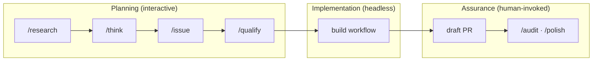

# Commands & Workflows

How commands and workflows relate, and the development flow centered on the build workflow.

📌 [日本語版](../.ja/docs/COMMANDS.md)

## The Development Flow

Humans refine the plan interactively, the build workflow implements it headlessly, and heavy assurance is human-invoked on the draft PR.

A fix confined to 1-3 files skips this column and completes directly via `/fix <issue number>`. Work spanning 4+ files or a new feature gets its plan written via `/think`, transferred into the issue's `## Plan` section via `/issue`, and then handed to build. `/qualify` is an optional pre-flight that detects build-stopping conditions before launch.

## The build Workflow

Launched via `Workflow({name: "build", args: {issue, repo, base?}})`. Taking a plan-backed issue as input, it runs 7 stages as a deterministic script. The division of labor is "extraction and implementation go to the LLM, verification and progression stay in the script": every LLM output passes a script-side cross-check.

| Stage      | What it does                                                                                                         |
| ---------- | -------------------------------------------------------------------------------------------------------------------- |
| Load       | Fetch the issue body verbatim, collect `## Plan` U-NNN / T-NNN ids deterministically, cross-check the LLM extraction |
| Revalidate | Re-verify the plan's Preconditions (path + anchor) against the current codebase                                      |
| Branch     | Fresh checkout and capture of the branch-point sha. Verify / Ship use this sha as their baseline                     |
| Code       | Delegate to `workflow("code")`. Each unit is implemented Red → Green and committed separately with plan trailers     |
| Cleanup    | A simplify-skill pass with test validation. Failing tests roll the edits back via stash                              |
| Verify     | Deterministic checks (diff scope + T-NNN matching) alongside conformance / structure reviews                         |
| Ship       | Remainder commit + draft PR. The PR body's fact sections are rendered deterministically from data                    |

Correctness checking is a comparison against the plan's own anchors (Preconditions, files scope, T-NNN statements, conformance), not an open-ended defect hunt. Defect hunting belongs to `/audit` on the draft PR.

### Stop Conditions

build does not repair broken input in place; it stops and hands it back. Representative stopped values (not exhaustive).

| stopped             | Meaning                                               | Hand-back                         |
| ------------------- | ----------------------------------------------------- | --------------------------------- |
| no-repo             | args carries no repo                                  | Fix the launch args               |
| no-plan             | The issue has no `## Plan` section                    | Write one via `/think` + `/issue` |
| extraction-mismatch | The LLM extraction's id sets diverge from the body    | Fix the plan's format             |
| oversized-unit      | A non-seam unit exceeds UNIT_CAPS (3 files / 4 tests) | Split the unit                    |
| revalidate-failed   | A Precondition does not exist in the current code     | Rewrite the plan's premises       |
| code-failed         | The code workflow could not complete a unit           | Revisit the plan's contract       |

### Staging Guards

Ship never uses `git add -A`; two never-stage sets keep foreign work out of the PR.

- Untracked files that predate the build (the baseline captured at Revalidate)
- Tracked modifications Verify judged outside the plan's scope (such as a concurrent session's edits)

### Governing DRs

| DR                                                                                          | Decision                                                                    |
| ------------------------------------------------------------------------------------------- | --------------------------------------------------------------------------- |
| [DR-0084](decisions/0084-retire-issue-gate-and-hand-issue-flow-orchestration-to-human.md)   | build never re-plans a human's `## Plan` section                            |
| [DR-0085](decisions/0085-replace-builds-audit-fan-out-with-selection-based-verification.md) | Heavy assurance (`/audit`, `/polish`) is human-invoked on the draft PR      |
| [DR-0088](decisions/0088-commit-each-unit-in-build-with-plan-anchors-as-trailers.md)        | Commit per unit; Verify / Ship baseline on the branch-point sha             |
| [DR-0089](decisions/0089-retire-build-plan-drafting-and-hand-plan-less-issues-back.md)      | A plan-less issue stops as no-plan and goes back for refinement             |
| [DR-0090](decisions/0090-unify-workspace-and-history-storage-locations.md)                  | Work products live in `.claude/workspace/`, records in `~/.claude/history/` |

## Workflow Roster

build nests only code. The others launch standalone.

| Workflow | Role                                                                | Main nested agents                                               |
| -------- | ------------------------------------------------------------------- | ---------------------------------------------------------------- |
| build    | End-to-end implementation of a plan-backed issue                    | code (nested), reviewer-conformance, reviewer-reuse              |
| code     | TDD implementation of a structured plan (Implement / Verify)        | Implementation agents (default sonnet), independent verify agent |
| audit    | Adversarial review fan-out over a diff                              | File-routed reviewers, critic-audit, critic-evidence             |
| polish   | External-lens (Codex) review + cleanup                              | critic-audit, enhancer-code                                      |
| assert   | Independent merge-readiness verdict (Codex in an isolated worktree) | codex, critic layer                                              |
| shake    | 4-dimension flaky-test detection and root-cause fix                 | Runner agents, static smell scan                                 |
| adrift   | Drift scan between DRs and current code                             | Manifest-routed reviewers                                        |

## Command → Implementation Mapping

| Command   | Implementation          | Form                                   |
| --------- | ----------------------- | -------------------------------------- |
| `/think`  | `skills/think/SKILL.md` | Skill (launches critic-design)         |
| `/fix`    | `skills/fix/SKILL.md`   | Skill (generator-test, resolver-build) |
| `/build`  | `workflows/build.js`    | Workflow                               |
| `/code`   | `workflows/code.js`     | Workflow (also nested from build)      |
| `/audit`  | `workflows/audit.js`    | Workflow                               |
| `/polish` | `workflows/polish.js`   | Workflow                               |

A skill executes its SKILL.md procedure in the conversation context; a workflow's script enforces progression. Processing that carries fan-out, loops, or gates goes into a workflow, in a shape the LLM cannot skip at its discretion ([WORKFLOWS](../rules/conventions/WORKFLOWS.md)).

## Related

- [SKILLS_AGENTS.md](./SKILLS_AGENTS.md). Skill and agent reference
- [DESIGN.md](./DESIGN.md). Layer structure and design philosophy
