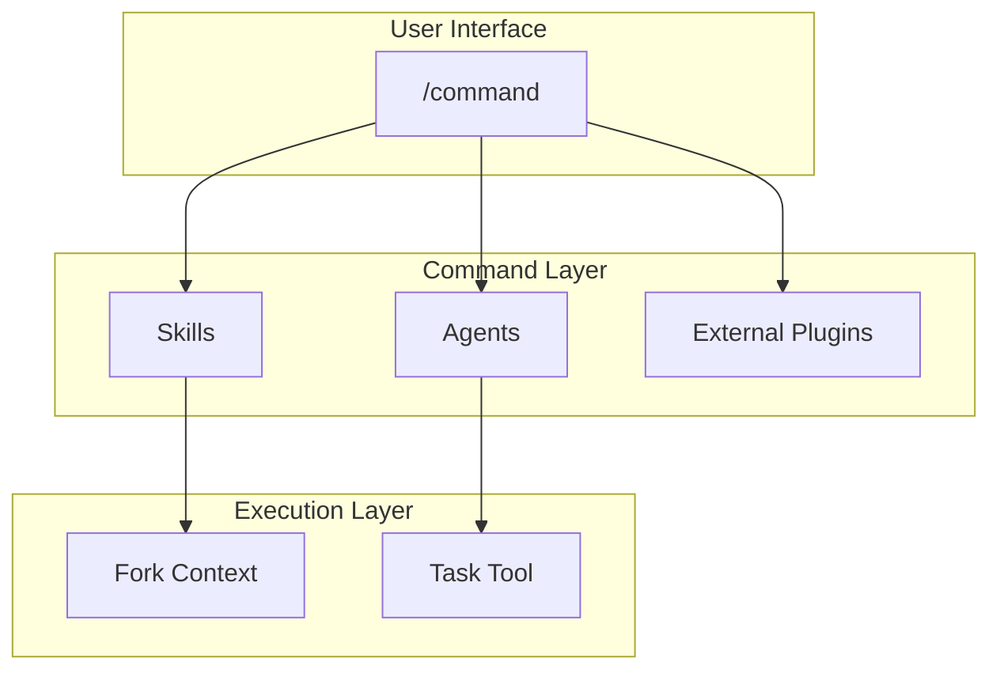

# Commands Design

Command design and relationships.

📌 **[日本語版](../.ja/docs/COMMANDS.md)**

## Architecture



## Design Principles

### 1. Thin Wrapper Pattern

Commands are orchestrators, no implementation details.

```markdown
# Good: /code

- Skills: use-workflow-tdd-cycle (RGRC cycle definition)
- Native: /goal (optional autonomous iteration)

# Bad

- Hardcoding TDD steps inside the command
```

### 2. Conditional Context Loading

Load skills only when needed.

```markdown
/code (no flags) → no additional skills
```

### 3. Graceful Degradation

Commands work without external plugins:

```markdown
/goal wrapping → autonomous iteration; absent → gates auto-retry + manual
confirmation (same functionality)
```

## Command → Skill/Agent Mapping

| Command   | Implementation             | Agents / nested calls                                                                  |
| --------- | -------------------------- | -------------------------------------------------------------------------------------- |
| `/think`  | `skills/think/SKILL.md`    | critic-design                                                                          |
| `/code`   | `workflows/code.js`        | general-purpose implementation and verification agents                                 |
| `/audit`  | `workflows/audit.js`       | file-routed reviewers, critic-audit, critic-evidence, enhancer-integration              |
| `/fix`    | `skills/fix/SKILL.md`      | generator-test, resolver-build                                                         |
| `/polish` | `workflows/polish.js`      | general-purpose, critic-audit, enhancer-code                                            |
| `/build`  | `workflows/build.js`       | Nests only code. Humans invoke audit and polish separately; fix is not chained          |

## File Structure

```text
skills/
├── fix/SKILL.md       # YAML front matter + execution steps
├── think/SKILL.md
└── ...
workflows/
├── code.js
├── audit.js
├── polish.js
├── build.js
└── ...
```

### Front Matter Fields

| Field           | Required | Purpose                                    |
| --------------- | -------- | ------------------------------------------ |
| `description`   | Yes      | Command description (Skill picker display) |
| `allowed-tools` | No       | Permitted tools                            |
| `model`         | No       | Model to use (opus/sonnet/haiku)           |
| `argument-hint` | No       | Hint shown for argument input              |

## Related

- [SKILLS_AGENTS.md](./SKILLS_AGENTS.md) - Skills and agents reference
