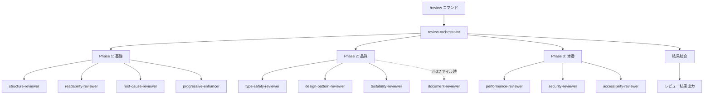

# エージェント構造マップ

## ディレクトリ構造と配置

```
~/.claude/
├── docs/
│   ├── MODEL_SELECTION.md      # モデル選択ガイドライン
│   └── AGENT_USAGE.md          # エージェント使用法（英語版）
│
└── agents/
    ├── orchestrators/      # オーケストレーター
    │   └── review-orchestrator.md [opus/indigo]
    │
    ├── frontend/          # フロントエンド専門レビューアー
    │   ├── readability-reviewer.md    [sonnet/cyan]
    │   ├── structure-reviewer.md      [sonnet/magenta]
    │   ├── root-cause-reviewer.md     [opus/red]
    │   ├── type-safety-reviewer.md    [sonnet/cyan]
    │   ├── performance-reviewer.md    [sonnet/orange]
    │   ├── security-reviewer.md       [sonnet/yellow]
    │   ├── accessibility-reviewer.md  [sonnet/pink]
    │   ├── design-pattern-reviewer.md [sonnet/purple]
    │   └── testability-reviewer.md    [sonnet/green]
    │
    └── general/          # 汎用レビューアー
        ├── progressive-enhancer.md  [sonnet/lime]
        ├── document-reviewer.md     [sonnet/brown]
        └── subagent-reviewer.md     [opus/gray]
```

## エージェント実行フロー



## エージェント間の関係性

### 協調関係
```
┌─────────────────────────────────────────┐
│         review-orchestrator             │
│              (統括・調整)                │
└─────────────────────────────────────────┘
                    ↓
    ┌──────────────┴──────────────┐
    ↓                             ↓
┌─────────────┐           ┌─────────────┐
│  基礎分析   │           │  専門分析   │
├─────────────┤           ├─────────────┤
│ structure   │←─────────→│ root-cause  │
│ readability │           │ (深い分析)  │
└─────────────┘           └─────────────┘
    ↓                             ↓
┌─────────────┐           ┌─────────────┐
│  品質保証   │           │  本番対応   │
├─────────────┤           ├─────────────┤
│ type-safety │           │ performance │
│ testability │           │ security    │
│ design-pat  │           │ a11y        │
└─────────────┘           └─────────────┘
```

### 相互参照パターン

| エージェント | 協調するエージェント | 理由 |
|------------|-------------------|------|
| structure-reviewer | root-cause-reviewer | 構造問題の根本原因分析 |
| readability-reviewer | design-pattern-reviewer | 可読性とパターンの整合性 |
| type-safety-reviewer | testability-reviewer | 型安全性とテスト容易性 |
| performance-reviewer | security-reviewer | 最適化とセキュリティのバランス |
| accessibility-reviewer | progressive-enhancer | アクセシビリティとプログレッシブエンハンスメント |

## コマンドマッピング

| コマンド | 使用エージェント | 条件 |
|---------|---------------|------|
| `/review` | 全エージェント | ファイルタイプに応じて自動選択 |
| `/review` + .md | +document-reviewer | .mdファイル検出時 |
| 未実装 | subagent-reviewer | `/review-agents` コマンド提案 |

## 色コード凡例

### 機能別グループ
- **🔵 青系 (cyan/indigo)**: 明瞭性・統括
- **🔴 赤系 (red/magenta/pink)**: 構造・重要分析
- **🟡 黄系 (yellow/orange)**: 警告・最適化
- **🟢 緑系 (green/lime)**: テスト・成長
- **🟣 紫系 (purple)**: パターン・設計
- **⚫ 中立系 (gray/brown)**: メタ・ドキュメント

## タイムアウト設定

| フェーズ | タイムアウト | エージェント数 |
|---------|------------|-------------|
| Phase 1 | 30秒 | 4エージェント |
| Phase 2 | 45秒 | 3-4エージェント |
| Phase 3 | 60秒 | 3エージェント |
| 合計最大 | 180秒 | 10-11エージェント |

## 利用統計（想定）

| 頻度 | エージェント | 用途 |
|-----|------------|------|
| 高 | readability, structure | 日常的なコードレビュー |
| 中 | type-safety, security | 品質チェック |
| 低 | document, subagent | 特定条件時のみ |

## 拡張性

### 新規エージェント追加時のチェックリスト
- [ ] YAMLフロントマター（name, description, tools, model, color）
- [ ] ユニークな色の割り当て
- [ ] 適切なディレクトリ配置（frontend/general/orchestrators）
- [ ] review-orchestratorへの統合
- [ ] コマンドへのマッピング
- [ ] 日本語ドキュメント更新
